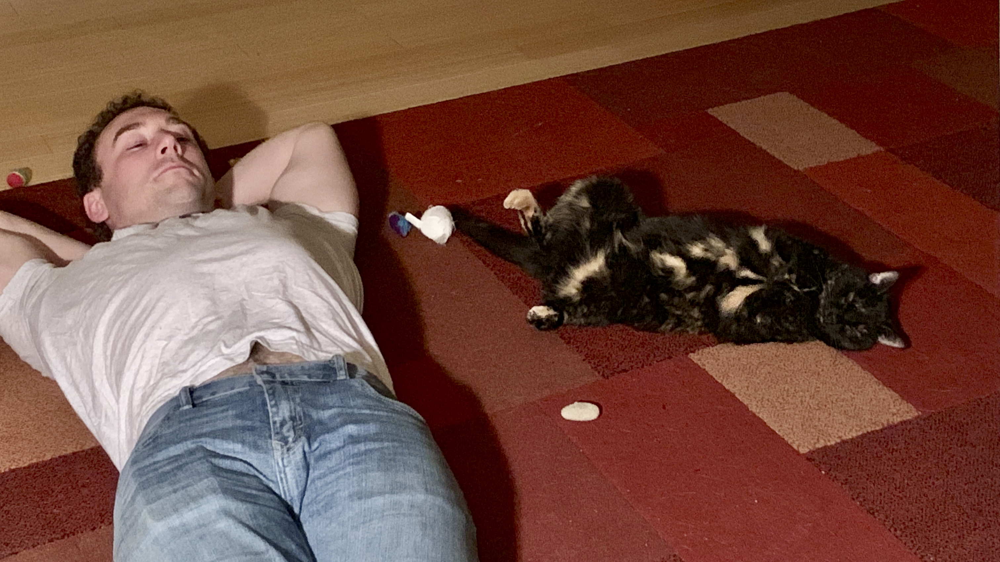
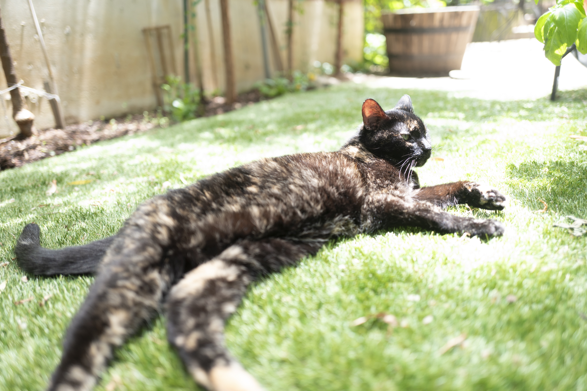
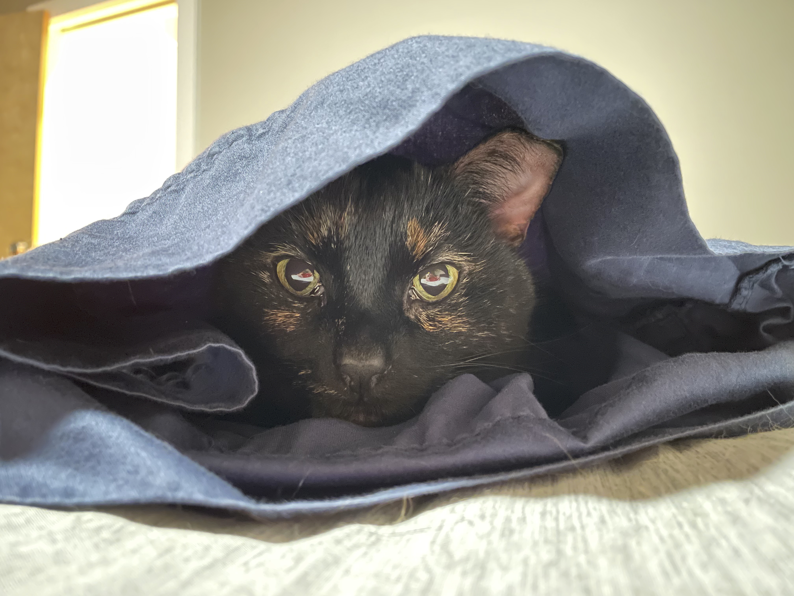
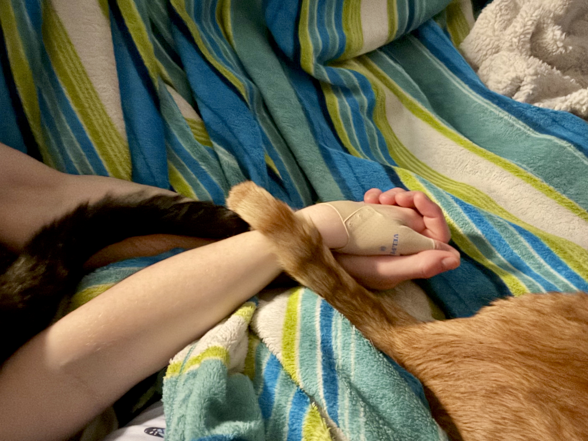

# Bant Kram-Beckman

2011-2026

Bant was our sassy tortie cat of 15 years. With her green-and-yellow eyes and black-and-gold fur coat, she could blend in to the dark of night or appear sprinkled with sun.
She had a kink at the tip of her tail, and her coloring made it look like she was wearing 1 1/2 socks on her back paws.

She is survived by her little brother Fox (whom she hated but secretly loved from when he was a kitten), her little sister Aria, and her loving parents/friends/servants Marybeth and Josh.

<video controls src="bant-fighting-fox-slow-mo.mov"></video>

Bant started life somewhere on the streets or in the fields around Champaign, IL and was rescued by the PAWS shelter.
When Josh and Marybeth visited the shelter for their anniversary and saw this 6 month-old kitten, she chose them by affectionately meowing and rubbing them from inside her cage and then jumping and playing around the room with them once set free. She loved rough play from Josh then and throughout the rest of her life.

<video controls src="bant-first-night-at-home.mov"></video>

At the shelter she was named "Karen" (as she and all her sisters were *Mean Girls*), but Bant was then named for [a little Jedi](https://www.thejediencyclopedia.com/character.php?Name=Bant+Eerin) in [a book series](https://en.wikipedia.org/wiki/Star_Wars:_Jedi_Apprentice) who was known for her great agility and friendship.

Throughout life, she would jump anywhere, fetching toys, climbing to the top of full screen doors in attempts to get outside, but she never ran away.

She would only drink running water, as still water was too boring.

<video controls src="bant-drinking-water-slow-mo.mov"></video>

She was one of the most vocal cats ever, always talking back to people in complaint or approval.
Often, she would swat at Josh in disgust, but never used her claws on people; she was too in control for that.
She would always come greet people at the door when they arrived home, no matter the hour.

<video controls src="bant-meowing-while-held.mov"></video>

Outside, she enjoyed sunning herself in the yard, listlessly chittering at the birds and aggressively hunting the rats.

<video controls src="bant-squeaking.mov"></video>

Inside, she enjoyed lying in Marybeth's lap and having her face rubbed by Josh.
She was *always* ready to give a head bump and would easily jump down to play with Josh on the floor.

Bant slept in between her parents every night since she was a kitten, and would demand they go to bed so that she could.
She followed them through 7 different homes (and with a duck, another with a dog) over the years, and many more life changes.

Bant was healthy and agile until late March 2026, when a vet visit uncovered an aggressive lymphoma and she declined within a week.
She passed peacefully at home, lying on her leather jacket, surrounded by her family and favorite toy that she carried with her since that Champaign shelter.

<audio controls src="bant-play-voice.m4a"></audio>

You can carry on her spirit by never accepting less than what you deserve, luxuriating in the sun, and leaning on those you love.

Bant was more partner-in-life than pet, the first to join our family, and our home will forever miss her voice.

With Eternal Love,
Josh, Marybeth, Aria, and Fox

<video controls src="bant-chittering-at-birds.mov"></video>

---

[Comments/Guestbook powered by a val.town val]

This allows visitors to write a memory of Bant or message to Bant or the family.

Visitors can also (or instead) "light a candle" for Bant.

- the val exposes an API endpoint for loading comments
- it stores comments in SQL storage
- each comment has the fields:
  - author name
  - body
  - timestamp
- in the UI:
  - all comments loaded via the API are rendered in ascending timestamp order
  - each comment body is displayed as plain text, along with the author's name
  - beneath the comments, a form is displayed to allow a visitor to write a comment
  - with inputs:
    - author name
    - body
    - anti-spam field asking when Bant as born (2011)
  - when submitted, the form makes a fetch request to create the comment, with the inputs
- the val exposes an API endpoint for accepting comments
  - if the anti-spam input is incorrect, it rejects the comment
  - otherwise, it stores the comment and returns it
  - the UI then reloads all comments, so that it can display the new comment

- the val exposes an API endpoint for loading a count of candles lit
- it stores the counter in blob storage
- in the UI:
  - a visitor can click a button to light a candle (this calls the val API to increment the counter)
  - the client then stores a flag in localstorage for this site, indicating they have lit a candle
  - the button is then disabled, once a candle has been lit
